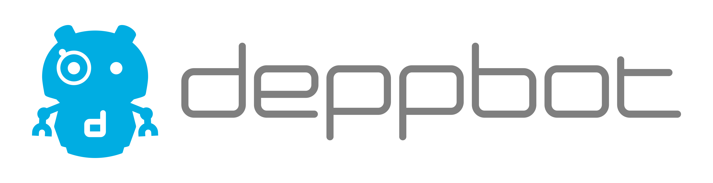
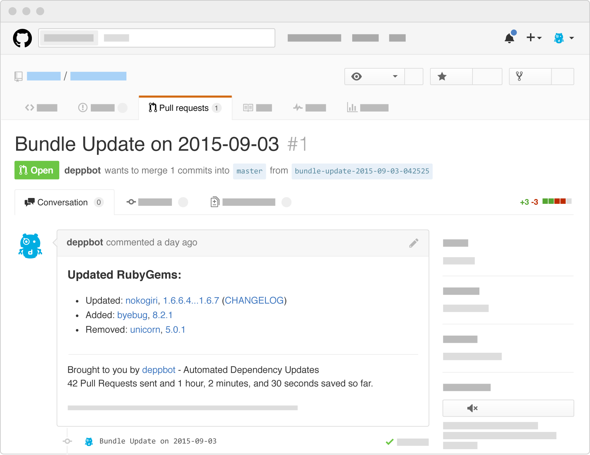
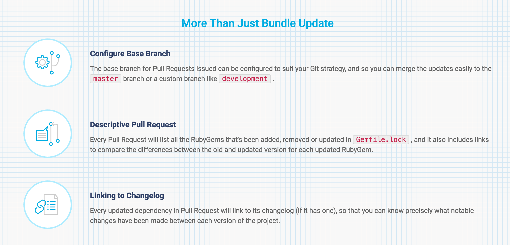
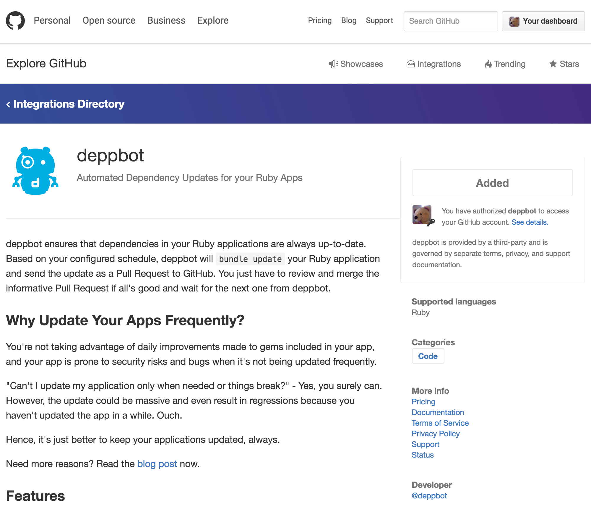
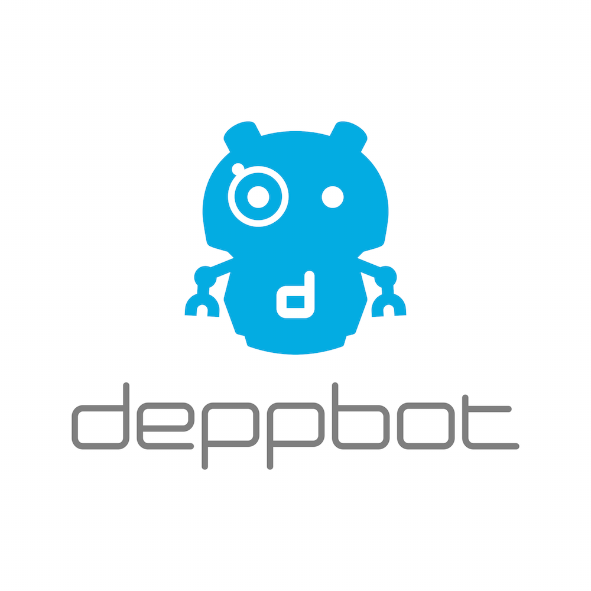

# deppbot - Automated Security and Dependency Updates

<table>
  <tr>
    <td><a href="https://www.deppbot.com/terms-of-service">Terms of Service</a></td>
    <td><a href="https://www.deppbot.com/privacy-policy)">PrivacyPolicy</a></td>
    <td><a href="https://www.deppbot.com/docs)">Docs</a></td>
    <td><a href="https://www.deppbot.com/pricing)">Pricing</a></td>
    <td><a href="https://twitter.com/deppbot)">Twitter</a></td>
    <td><a href="https://www.deppbot.com/faq)">FAQ</a></td>
  </tr>
</table>

deppbot ensures that your Ruby applications are kept updated, always! Based on your configured schedule, deppbot will run bundle update on your Ruby app and send the result as a Pull Request to GitHub. deppbot will also check your app periodically for any RubyGem vulnerabilities and fix it automagically.

## Do, Don't Tell

Your time is precious. deppbot doesn't just tell you that your app is insecure or outdated. deppbot does the update for you with Pull Requests that are easy to review and ready to be merged.

## Why Update Your Apps Frequently?

You're not taking advantage of daily improvements made to gems included in your app, and your app is prone to security risks and bugs when it's not being updated frequently.

"Can't I update my app only when things break?" - Yes, you surely can! However, the update could be massive and even result in regressions because you haven't updated the app in a while. Ouch!

Hence, it's just better to keep your apps updated, always.

Need more reasons? Read the [blog post](https://github.com/jollygoodcode/jollygoodcode.github.io/issues/3) now.

## How It Works?

Sign in with your GitHub login, and subscribe your repos.

deppbot will bundle update daily and issue a Pull Request to GitHub. It's even better if you have CI (Travis etc) hooked up to GitHub as the CI will run against deppbot's Pull Request and allow you to review whether any of the RubyGem updates is going to break your app.

Merge the Pull Request if all's good and it's that simple.

View an example of a [deppbot Pull Request on Ruby Bench](https://github.com/ruby-bench/ruby-bench-web/pull/123).

## More Than Just Bundle Update

## As seen

- On GitHub Integrations

  

- [On stackshare](http://stackshare.io/deppbot/deppbot)
- [On siftery](https://www.siftery.com/deppbot)

## Contact Us

Do you have feedback about deppbot or a question that the FAQ doesn't address?

Do you use BitBucket or GitLab and you wish deppbot supports these services?

Please tell us about it. We love to hear from you!

- Mail to: `ask@deppbot.com`
- fill in form on https://www.deppbot.com
- https://github.com/deppbot/feedback

## License

The gem is available as open source under the terms of the [MIT License](http://opensource.org/licenses/MIT).

